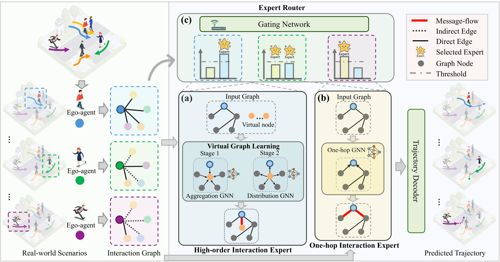

[](https://github.com/Carrotsniper/ViTE/blob/main/LICENSE)
## ViTE: Virtual Graph Trajectory Expert Router for Pedestrian Trajectory Prediction


This is the official implementation of our paper **ViTE** [https://arxiv.org/abs/2511.12214](https://arxiv.org/abs/2511.12214).

This work has been accepted at the Association for the Advancement of Artificial Intelligence (AAAI 2026).



## Abstract
Pedestrian trajectory prediction is critical for ensuring safety in autonomous driving, surveillance systems, and urban planning applications. While early approaches primarily focus on one-hop pairwise relationships, recent studies attempt to capture high-order interactions by stacking multiple Graph Neural Network (GNN) layers. However, these approaches face a fundamental trade-off: insufficient layers may lead to under-reaching problems that limit the model's receptive field, while excessive depth can result in prohibitive computational costs. We argue that an effective model should be capable of adaptively modeling both explicit one-hop interactions and implicit high-order dependencies, rather than relying solely on architectural depth. To this end, we propose ViTE (Virtual graph Trajectory Expert router), a novel framework for pedestrian trajectory prediction. ViTE consists of two key modules: a Virtual Graph that introduces dynamic virtual nodes to model long-range and high-order interactions without deep GNN stacks, and an Expert Router that adaptively selects interaction experts based on social context using a Mixture-of-Experts design. This combination enables flexible and scalable reasoning across varying interaction patterns. Experiments on three benchmarks (ETH/UCY, NBA, and SDD) demonstrate that our method consistently achieves state-of-the-art performance, validating both its effectiveness and practical efficiency.

#### Steps
1. Clone the project into a local machine：
   ```bash
   git clone https://github.com/Carrotsniper/UniEdge.git
   ```
2. Enter the project and unzip dataset files：
   ```bash
   cd UniEdge
   unzip dataset.zip
   ```
3. Install environments：
   ```bash
   conda env create -f environment.yaml
   ```
4. Run testing：
   ```bash
   python test.py
   ```

### Acknowledgement
Part of our code is borrowed from [DDL](https://github.com/sydney-machine-learning/pedestrianpathprediction), [GP-GRAPH](https://github.com/InhwanBae/GPGraph), [iTransformer](https://github.com/thuml/iTransformer), 
[CaST](https://github.com/yutong-xia/CaST), [GATv2](https://github.com/tech-srl/how_attentive_are_gats). We thank the authors for releasing their code and models.

## Cite this Work

If this work is useful, please consider citing the paper, and/or mentioning this repository:
```bibtex
@article{li2025uniedge,
  title={Unified Spatial-Temporal Edge-Enhanced Graph Networks for Pedestrian Trajectory Prediction},
  author={Li, Ruochen and Qiao, Tanqiu and Katsigiannis, Stamos and Zhu, Zhanxing and Shum, Hubert PH},
  journal={IEEE Transactions on Circuits and Systems for Video Technology},
  year={2025},
  publisher={IEEE}
}
```
